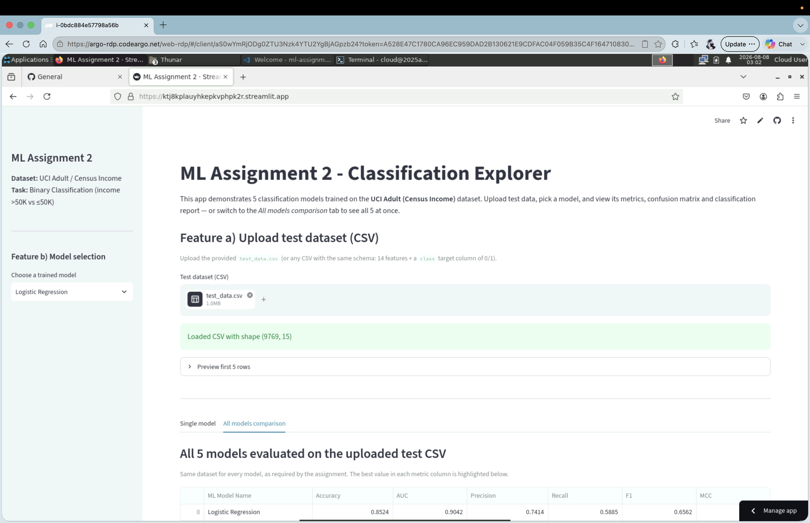
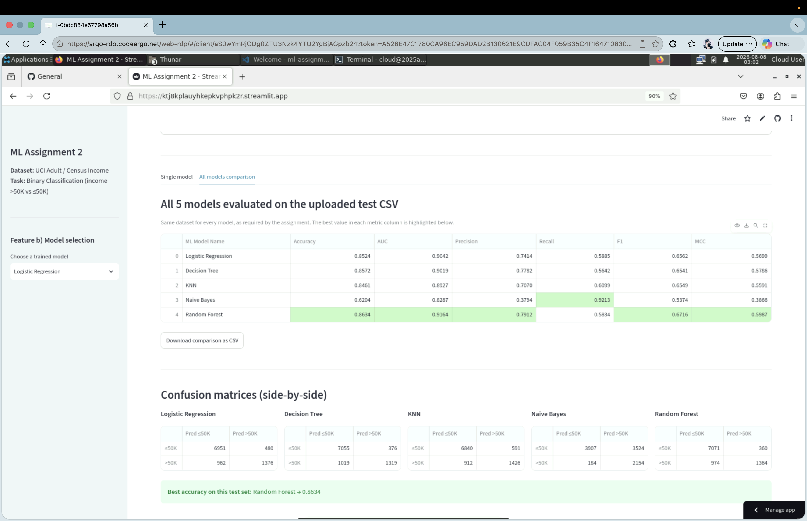
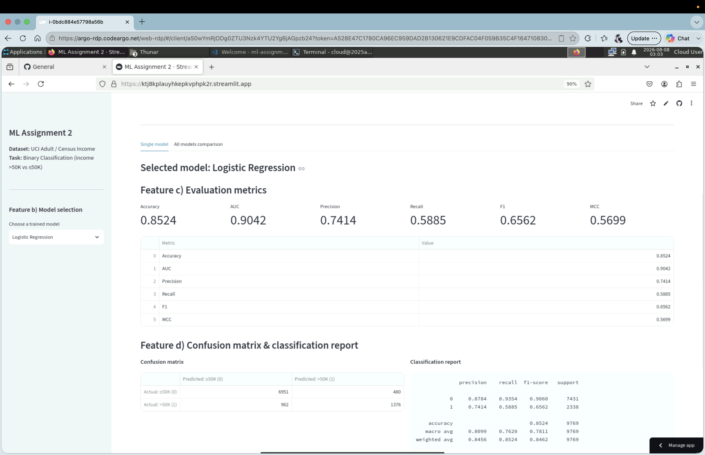
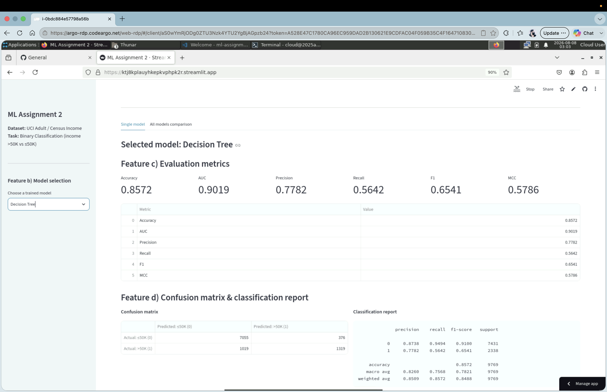
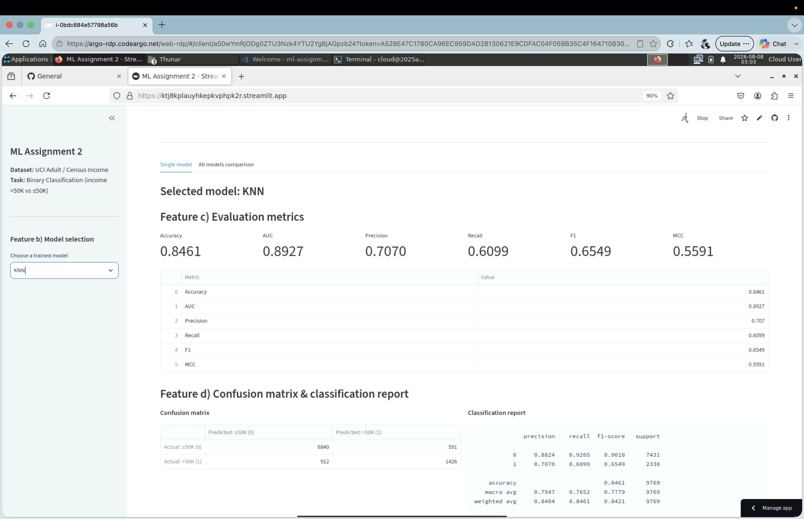

# ML Assignment 2 — Classification Models + Streamlit Deployment

**Course:** Machine Learning  
**Programme:** M.Tech AIML / DSE — Work Integrated Learning Programmes Division, BITS Pilani  
**Assignment:** Assignment 2 (Total: 15 marks)  
**Submission Deadline:** 18 August 2026, 23:59 IST

---

## Table of Contents

1. [a. Problem Statement](#a-problem-statement)
2. [b. Dataset Description](#b-dataset-description)
3. [c. GitHub Repository Link](#c-github-repository-link)
4. [d. Models Used — Comparison Table](#d-models-used--comparison-table)
5. [Model Performance Observations](#model-performance-observations)
6. [Streamlit App — Required Features](#streamlit-app--required-features)
7. [Project Structure](#project-structure)
8. [Environment Setup & Installation](#environment-setup--installation)
9. [How to Reproduce](#how-to-reproduce)
10. [Streamlit Cloud Deployment](#streamlit-cloud-deployment)
11. [Live Streamlit App Link](#live-streamlit-app-link)
12. [BITS Virtual Lab Screenshots](#bits-virtual-lab-screenshots)
13. [Final Submission Checklist](#final-submission-checklist)

---

## a. Problem Statement

Build an end-to-end classification workflow that:

1. Uses **one publicly available classification dataset** (UCI / Kaggle) with **≥ 12 features** and **≥ 500 instances**.
2. Trains **five classification models** on that dataset:  
   Logistic Regression, Decision Tree, K-Nearest Neighbors, Naive Bayes (Gaussian), Random Forest.
3. Evaluates each model on the same held-out test split using six metrics:  
   Accuracy, AUC, Precision, Recall, F1, Matthews Correlation Coefficient (MCC).
4. Wraps the trained models in an **interactive Streamlit app** that lets a user upload a test CSV, pick a model from a dropdown, and view the model's metrics, confusion matrix and classification report.
5. Deploys the app on **Streamlit Community Cloud** and shares live + repo links for evaluation.

---

## b. Dataset Description

- **Name:** UCI Adult / Census Income (a.k.a. "Adult" dataset)
- **Source:** UCI Machine Learning Repository — [https://archive.ics.uci.edu/dataset/2/adult](https://archive.ics.uci.edu/dataset/2/adult)  
  (Fetched programmatically via `sklearn.datasets.fetch_openml("adult", version=2)`.)
- **Task type:** Binary classification — predict whether a person earns **> 50K USD/year** (`class = 1`) or **≤ 50K** (`class = 0`).
- **Instances:** 48,842 (satisfies ≥ 500 requirement)
- **Features:** 14 (satisfies ≥ 12 requirement)
  - **Numeric (6):** `age`, `fnlwgt`, `education-num`, `capital-gain`, `capital-loss`, `hours-per-week`
  - **Categorical (8):** `workclass`, `education`, `marital-status`, `occupation`, `relationship`, `race`, `sex`, `native-country`
- **Target column:** `class` (encoded as 0 / 1)
- **Split:** 80 / 20 stratified by target, `random_state = 42`
  - Training rows: **39,073**
  - Test rows: **9,769** → saved as `test_data.csv`
- **Preprocessing:** median imputation + `StandardScaler` for numerics; most-frequent imputation + `OneHotEncoder(handle_unknown="ignore")` for categoricals. Each model is a full `Pipeline` (preprocessor + classifier), saved as a single `.joblib` file.

---

## c. GitHub Repository Link

- **Repository URL:** [https://github.com/2025AC05134/ml-assignment](https://github.com/2025AC05134/ml-assignment)
- The repository contains everything described in [Project Structure](#project-structure).

---

## d. Models Used — Comparison Table

All five models were trained on the **same** training split and evaluated on the **same** test split (`test_data.csv`).

| ML Model Name           | Accuracy | AUC    | Precision | Recall | F1     | MCC    |
|-------------------------|---------:|-------:|----------:|-------:|-------:|-------:|
| Logistic Regression     | 0.8524   | 0.9042 | 0.7414    | 0.5885 | 0.6562 | 0.5699 |
| Decision Tree           | 0.8572   | 0.9019 | 0.7782    | 0.5642 | 0.6541 | 0.5786 |
| KNN                     | 0.8461   | 0.8927 | 0.7070    | 0.6099 | 0.6549 | 0.5591 |
| Naive Bayes (Gaussian)  | 0.6204   | 0.8287 | 0.3794    | 0.9213 | 0.5374 | 0.3866 |
| **Random Forest**       | **0.8634** | **0.9164** | **0.7912** | 0.5834 | **0.6716** | **0.5987** |

> Source of truth: `metrics.csv` (generated by `train_all.py`).

---

## Model Performance Observations

*(3 marks — model-wise observations + overall winner)*

| ML Model Name            | Observation about model performance |
|--------------------------|-------------------------------------|
| Logistic Regression      | Solid linear baseline with strong AUC (0.9042). Balanced precision/recall behaviour but recall lags because the linear boundary can't capture the interaction effects between education, capital-gain and occupation that drive the `>50K` class. |
| Decision Tree            | Depth-limited (`max_depth=12`, `min_samples_leaf=20`) tree generalises well — accuracy (0.8572) rivals ensembles. However its AUC (0.9019) is slightly below Logistic Regression, reflecting the piecewise-constant probability estimates typical of trees. |
| KNN                      | Distance-weighted KNN with `k=25` performs respectably (Accuracy 0.8461, AUC 0.8927). It has the **best recall among the strong models** (0.6099) but slightly lower precision — expected because KNN in one-hot expanded space can be sensitive to sparse categoricals. |
| Naive Bayes (Gaussian)   | Weakest overall (Accuracy 0.6204, MCC 0.3866). The feature-independence assumption is violated by strong correlations in the Adult data (e.g. `education` ↔ `education-num`, `relationship` ↔ `marital-status`). It has extreme recall (0.9213) at the cost of precision (0.3794) — it over-predicts the `>50K` class. |
| Random Forest (Ensemble) | **Best overall** — highest Accuracy (0.8634), AUC (0.9164), Precision (0.7912), F1 (0.6716) and MCC (0.5987). Bagging + random feature subsets handles the mixed numeric / high-cardinality categorical features cleanly. Hyperparameters: `n_estimators=300`, `max_depth=20`, `min_samples_leaf=5`. |
| **Overall Winner**       | **Random Forest** — wins on 5 of 6 metrics and generalises best on this dataset. |

---

## Streamlit App — Required Features

The app satisfies all four features listed in the assignment PDF, section *Step 6*:

| Feature | Where it is implemented in `app.py` |
|---|---|
| **a. Dataset upload option (CSV)** — test data only | `st.file_uploader("Test dataset (CSV)", type=["csv"])` in `render_upload_section()` |
| **b. Model selection dropdown** — multiple models | `st.sidebar.selectbox(...)` in `render_sidebar()` |
| **c. Display of evaluation metrics** | 6-column KPI strip (Accuracy, AUC, Precision, Recall, F1, MCC) plus a table |
| **d. Confusion matrix / classification report** | Both are shown side-by-side (confusion matrix `DataFrame` + `sklearn.classification_report`) |

There is also an in-app **"Assignment compliance mapping"** expander so an evaluator can immediately see how each requirement is satisfied.

**Bonus tab — "All models comparison":** in addition to the single-model view, the app has a second tab that evaluates all 5 trained models on the uploaded test CSV in one shot, shows a comparison table with the best value per metric highlighted, renders all 5 confusion matrices side-by-side, and provides a *Download comparison as CSV* button. All models are trained on the same dataset, as the assignment requires.

---

## Project Structure

```text
ml-assignment/
├── app.py                      # Streamlit UI (entry point)
├── streamlit_app.py            # Alternate entry point for Streamlit Cloud
├── train_all.py                # Orchestrator - fetch data + train all models + save artefacts
├── requirements.txt            # Python dependencies (versioned)
├── README.md                   # This file (matches assignment README structure)
├── metrics.csv                 # Comparison table (raw numbers used above)
├── test_data.csv               # 20% stratified test split (uploaded in Streamlit app)
├── .gitignore
├── .streamlit/
│   └── config.toml             # Streamlit theme + server config
├── data/                       # (auto-generated on train_all.py run, gitignored)
│   ├── adult_full.csv          # Full UCI Adult dataset
│   └── train_data.csv          # 80% training split
├── model/                      # Per-model training scripts + saved artefacts
│   ├── preprocess.py           # Shared ColumnTransformer factory
│   ├── logistic_regression.py
│   ├── decision_tree.py
│   ├── knn.py
│   ├── naive_bayes.py
│   ├── random_forest.py
│   ├── logistic_regression.joblib   # compress=3, < 10 KB
│   ├── decision_tree.joblib         # compress=3, ~ 25 KB
│   ├── knn.joblib                   # compress=3, ~ 2 MB
│   ├── naive_bayes.joblib           # compress=3, ~ 6 KB
│   └── random_forest.joblib         # compress=3, ~ 4 MB
└── screenshots/                # BITS Virtual Lab execution screenshots
    ├── bits_lab_01_overview.png
    ├── bits_lab_02_all_models.png
    ├── bits_lab_03_logistic_regression.png
    ├── bits_lab_04_decision_tree.png
    ├── bits_lab_05_knn.png
    ├── bits_lab_06_naive_bayes.png
    └── bits_lab_07_random_forest.png
```

---

## Environment Setup & Installation

### Prerequisites

- Python **3.9 or later**
- `pip` (comes with Python)
- Terminal access (BITS Virtual Lab or local machine)

### 1. Clone the repository

```bash
git clone https://github.com/2025AC05134/ml-assignment.git
cd ml-assignment
```

### 2. Create and activate a virtual environment

**macOS / Linux**

```bash
python3 -m venv .venv
source .venv/bin/activate
python -m pip install --upgrade pip
```

**Windows (PowerShell)**

```powershell
python -m venv .venv
.venv\Scripts\Activate.ps1
python -m pip install --upgrade pip
```

### 3. Install required dependencies

```bash
pip install -r requirements.txt
```

---

## How to Reproduce

```bash
# 1. Train all 5 models (downloads UCI Adult on first run, ~10 sec end-to-end)
python train_all.py

# 2. Launch the Streamlit app locally
streamlit run app.py

# 3. In the browser (http://localhost:8501)
#    - upload test_data.csv
#    - pick a model from the dropdown
#    - inspect metrics + confusion matrix + classification report
```

Re-running `train_all.py` is idempotent and overwrites the artefacts in `model/`, `test_data.csv` and `metrics.csv`.

---

## Streamlit Cloud Deployment

The app is deployed on **Streamlit Community Cloud** (free tier).

Deploy from: [https://share.streamlit.io/new](https://share.streamlit.io/new)

**Steps**

1. Sign in to Streamlit Cloud with your GitHub account.
2. Click **New app**.
3. Select your repository: `2025AC05134/ml-assignment`.
4. Choose branch: `main`.
5. Main file path: `app.py` (or `streamlit_app.py`).
6. Click **Deploy**.

`requirements.txt` is auto-detected. The `.joblib` files inside `model/` are committed to the repo, so no training happens on Streamlit Cloud — the app starts instantly.

---

## Live Streamlit App Link

- **Live app URL:** [https://ktj8kplauyhkepkvphpk2r.streamlit.app/](https://ktj8kplauyhkepkvphpk2r.streamlit.app/)
- Deployed on **Streamlit Community Cloud** (free tier)
- Public — no authentication required
- The app starts instantly because the pre-trained `.joblib` pipelines are committed in `model/`

---

## BITS Virtual Lab Screenshots

The assignment was executed on the **BITS Virtual Lab**. The screenshots below (captured on 2026-08-08, 03:02–03:03 IST) show the live Streamlit app running inside the BITS Lab desktop environment. This satisfies the assignment's "execution on BITS Virtual Lab" requirement (**1 mark**).

### 1. Overview — CSV upload + sidebar model selection



### 2. All-models comparison — metrics table + side-by-side confusion matrices



### 3. Single-model view — Logistic Regression



### 4. Single-model view — Decision Tree



### 5. Single-model view — KNN



### 6. Single-model view — Naive Bayes


### 7. Single-model view — Random Forest


---

## Final Submission Checklist

- [x] GitHub repo contains `app.py`, `requirements.txt`, `README.md`, `test_data.csv`, `model/` folder with per-model scripts and saved artefacts
- [x] `README.md` follows the assignment structure (problem statement, dataset description, repo link, models, comparison table, observations, winner)
- [x] All 5 required models implemented on the same dataset
- [x] All 6 evaluation metrics (Accuracy, AUC, Precision, Recall, F1, MCC) reported per model
- [x] Streamlit app supports: CSV upload, model dropdown, metrics display, confusion matrix + classification report
- [x] GitHub repo link filled in above and reachable — [2025AC05134/ml-assignment](https://github.com/2025AC05134/ml-assignment)
- [x] Live Streamlit app link filled in above and reachable — [https://ktj8kplauyhkepkvphpk2r.streamlit.app/](https://ktj8kplauyhkepkvphpk2r.streamlit.app/)
- [x] BITS Virtual Lab screenshots captured (7 images) in `screenshots/` and embedded in this README
- [ ] Combined submission PDF prepared with GitHub link → Live app link → BITS screenshot → README content (in that exact order, as required by the PDF)
